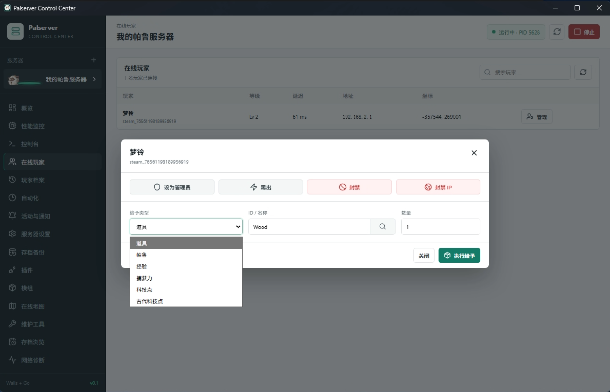

# Palserver Launcher

Palworld 专用服务器管理器。Windows 使用 Wails 2 桌面端，Linux 使用 Go 后台 Agent 和同一套 React 网页控制台。

当前版本：**0.1.6**

## 主要功能

- 自动封装 SteamCMD 并安装、更新 Palworld 专用服务器
- 多服务器实例、启停、性能监控和实时控制台
- 每个实例可独立设置 Agent/启动器启动后自动开服，多服务器按顺序启动并跳过已运行进程
- Windows 原生进程状态内核、后台退出监控和多实例进程识别
- 服务器能力中心，按 REST、RCON 和插件状态控制功能可用性
- UE4SS / PalDefender 兼容检查、崩溃识别和可恢复安全模式
- 玩家、封禁、白名单、活动、自动维护和通知管理
- 存档备份、官方备份、恢复和只读存档浏览
- 新备份包含逐文件 SHA-256 完整性清单，恢复前后校验并拒绝篡改、缺失或额外文件
- PalDefender、UE4SS、Pak、LogicMods 和 Lua 模组管理
- Nexus UE4SS 服务器插件目录、版本检查和 ZIP 安装更新
- Palworld 1.0 服务器设置中文编辑器
- Linux 64 位后台服务、SteamCMD 自动安装、systemd 托管和首次访问创建密码的网页控制台
- Windows/Linux 一键脱敏诊断包，包含状态、兼容信息、配置与日志尾部，不包含存档和管理密码
- 配置原子写入、上一版本自动备份和损坏文件隔离恢复，避免配置异常导致启动器无法打开
- 管理员密码与入服密码不再明文写入启动器配置；Windows 使用 DPAPI，Linux 使用本机 AES-GCM 密钥加密

## 界面预览

### 服务器概览


### 在线玩家管理



### 自动化与维护计划


## 构建

Windows 开发环境需要 Go、Node.js、Wails CLI 和 WebView2：

```powershell
npm install --prefix frontend
go test ./...
wails build
```

构建结果位于 `build/bin/palserver-launcher.exe`。

Linux Agent 使用无 CGO 交叉编译：

```powershell
npm run build --prefix frontend
$env:GOOS='linux'; $env:GOARCH='amd64'; $env:CGO_ENABLED='0'
go build -trimpath -o build/bin/pal-agent-linux-amd64 .
go run ./cmd/package-linux
```

打包器会生成 `build/palserver-agent-linux-amd64.tar.gz` 和对应的 `.sha256`，并在 Windows/Linux 上固定 `pal-agent`、安装脚本与卸载脚本的 Linux 可执行权限。

普通 Linux 用户可以直接一键安装最新 Release：

```bash
curl -fsSL https://raw.githubusercontent.com/zhumengling/Palserver-Launcher/main/deploy/linux/install-online.sh | sudo bash
```

没有 Linux 主机时，可以在 Windows 本机启动隔离的网页预览 Agent：

```powershell
npm run build --prefix frontend
go run -tags webpreview .
```

打开 `http://127.0.0.1:18210`，第一次访问时创建管理密码。预览模式只允许监听本机地址，并默认使用临时数据目录，不会读取正式启动器配置。它默认模拟 Linux Agent 的网页能力视图，便于没有 Linux 主机时检查 Linux 专属界面；如需检查 Windows 网页视图，可增加 `--platform windows`。平台模拟只影响网页能力展示，实际文件和进程操作仍由开发机操作系统实现。

Linux 安装、systemd 和安全访问说明见 [docs/linux-server.md](docs/linux-server.md)。

普通用户可以直接从 GitHub Releases 下载编译版本，无需安装开发工具。

## 自动构建与长期路线

- `main` 分支和 Pull Request 会在 Windows amd64 环境自动执行 Go、前端测试和 Wails 构建。
- 推送与项目版本一致的 `v*` 标签会生成固定名称的 Windows amd64 Release 文件及 SHA-256。
- Release 同时生成 Windows amd64 桌面程序和 Linux amd64 Agent 安装包。
- Linux 多节点和集中管理的后续路线见 [docs/linux-agent-roadmap.md](docs/linux-agent-roadmap.md)。
