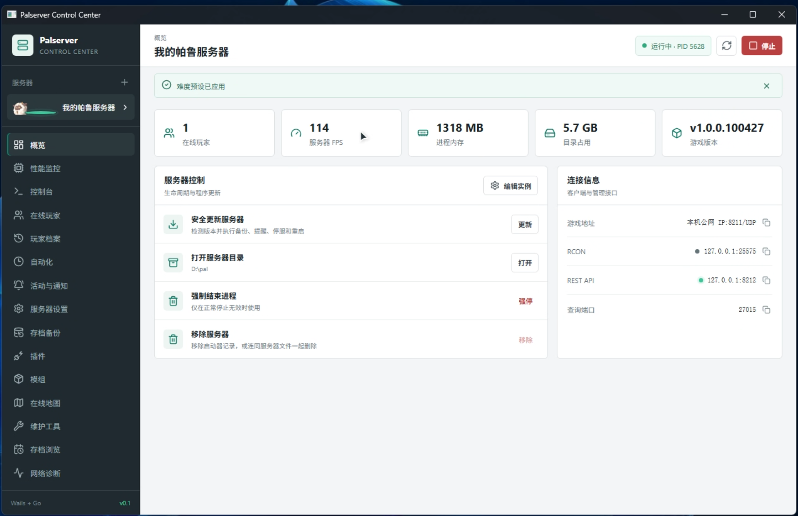
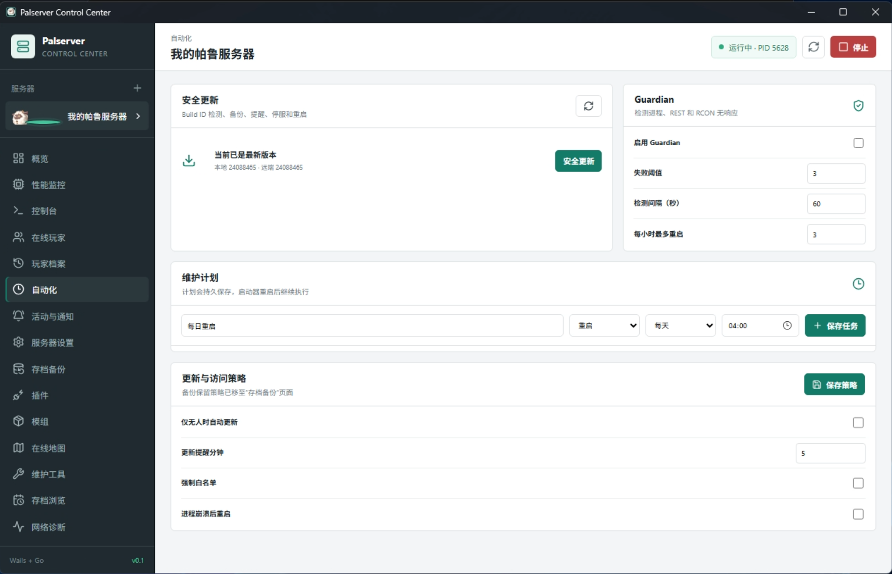

# Palserver Launcher

Palworld 专用服务器的一体化 Windows 启动器，使用 Wails 2、React 和 Go 构建。

当前版本：**0.1**

## 主要功能

- 自动封装 SteamCMD 并安装、更新 Palworld 专用服务器
- 多服务器实例、启停、性能监控和实时控制台
- 玩家、封禁、白名单、活动、自动维护和通知管理
- 存档备份、官方备份、恢复和只读存档浏览
- PalDefender、UE4SS、Pak、LogicMods 和 Lua 模组管理
- Nexus UE4SS 服务器插件目录、版本检查和 ZIP 安装更新
- Palworld 1.0 服务器设置中文编辑器

## 界面预览

### 服务器概览



### 自动化与维护计划



## 构建

开发环境需要 Go、Node.js、Wails CLI 和 WebView2：

```powershell
npm install --prefix frontend
go test ./...
wails build
```

构建结果位于 `build/bin/palserver-launcher.exe`。

普通用户可以直接从 GitHub Releases 下载编译版本，无需安装开发工具。
